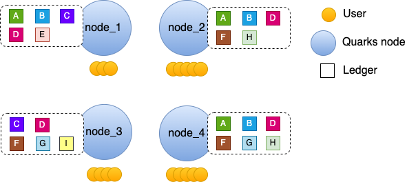
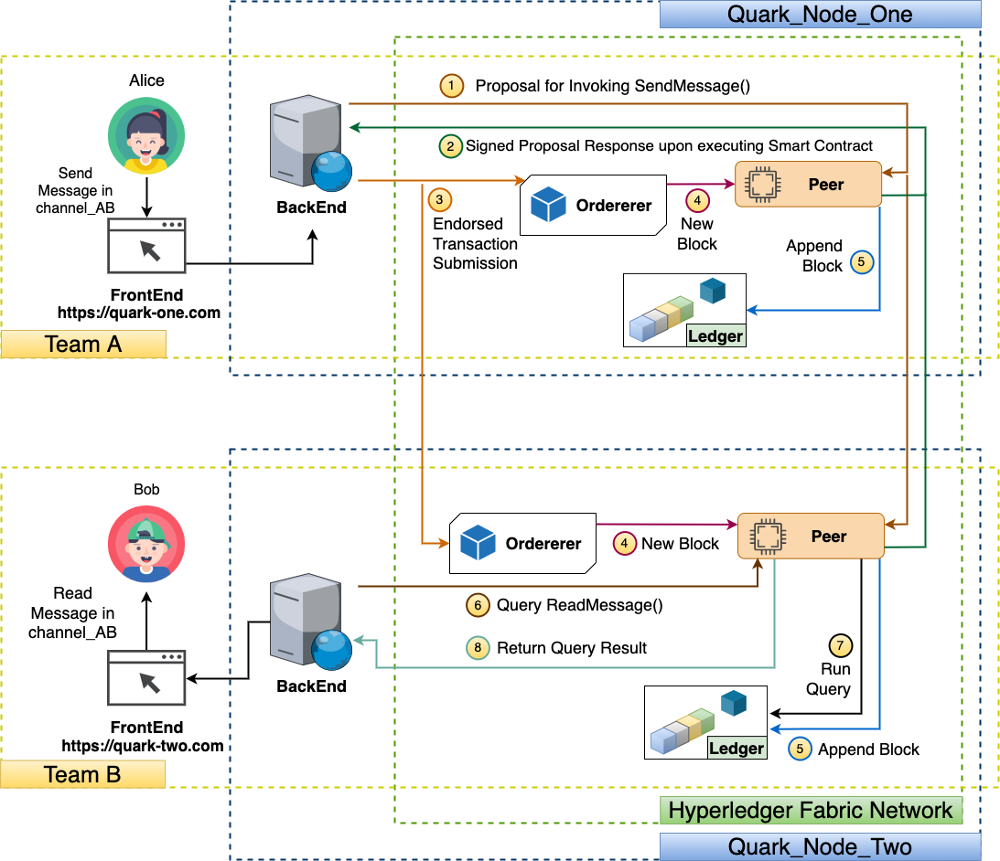
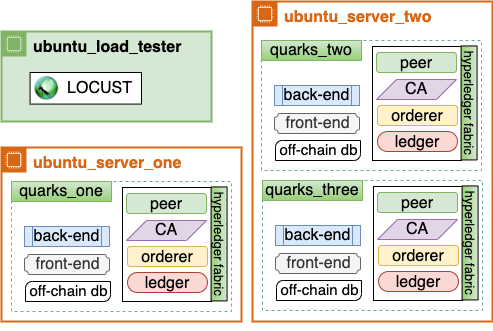

# Quarks network
### A Secure and Decentralized Blockchain-Based Instant Messaging Network
There has been a rise in the usage of instant messaging services for group communication, 
both in enterprise and consumer environments in the last two decades. Many of these instant messaging platforms
have been developed and incorporated secure protocols such as end-to-end encryption in their platforms.
By adopting these protocols these platforms demonstrate strong security properties like future secrecy for one-to-one communication.
However, these services have failed to achieve security attributes like confidentiality, integrity, privacy, and future secrecy for 
group communications. In this project, we present a novel blockchain-based secure instant messaging network named 
*Quarks* that overcomes the security pitfalls of the existing systems. We have analyzed our design of the network with security models
and definitions from existing literature to demonstrate the network's reliability and usability. We have developed a Proof of Concept (PoC)
of the *Quarks* system leveraging Distributed Ledger Technology (DLT), and conducted load testing on that. Experimental results demonstrate
that our PoC system performs decently and assures us the applicability of such systems in near future.  

This project aims to eradicate the shortcomings of existing secure private messaging. Quarks 
is an open network for secure, private and distributed communication. Quarks network ensures
- Non-repudiation
- User's control over privacy
- User's control over who will host their data
- Open Standard

### High Level View
Network View:  

Alice, Bob, and Charlie communicating in Quarks
Network:  

### Message flow in the proof-of-concept-network

### Load Testing Architecture

## TODO
- [X] implement proof of concept  
- [X] load test proof of concept
- [ ] publish academic findings
- [ ] develop alpha version
- [ ] run pilot
- [ ] develop beta version
- [ ] public release